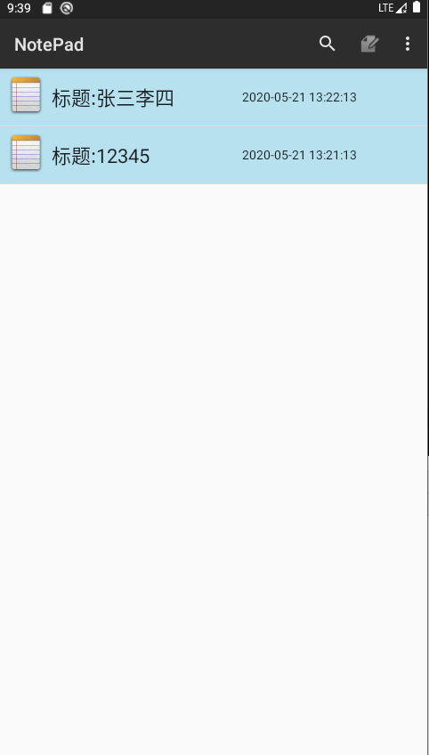
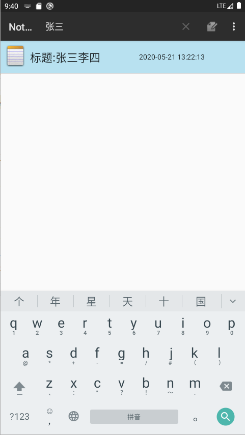

## 一.显示时间戳

#### 1.在noteslist_item.xml中添加一个Imageview用来显示图像，两个Textview分别显示时间和标题

```java
<ImageView
    android:layout_width="48dp"
    android:layout_height="48dp"
    android:layout_marginLeft="5dp"
    android:layout_marginTop="5dp"
    android:background="@drawable/app_notes"/>
```


```java
<TextView
    android:id="@android:id/text1"
    android:layout_width="match_parent"
    android:layout_height="match_parent"
    android:layout_weight="1"
    android:gravity="center_vertical"
    android:paddingLeft="5dip"
    android:singleLine="true"
    android:textAppearance="?android:attr/textAppearanceLarge" />
<TextView
    android:id="@android:id/text2"
    android:layout_width="match_parent"
    android:layout_height="match_parent"
    android:layout_weight="1"
    android:gravity="center_vertical"
    android:paddingLeft="5dip"
    android:textSize="14dp"
    android:singleLine="true"
    android:textAppearance="?android:attr/textAppearanceLarge" />
```
#### 2.继承SimpleCursorAdapter，重写bindView（）显示时间并用SimpleDateFormat函数转化时间格式

```java
public class MySimpleCursorAdapter extends SimpleCursorAdapter {
    public MySimpleCursorAdapter(Context context, int layout, Cursor c, String[] from, int[] to, int flags) {
        super(context, layout, c, from, to, flags);
    }

    public MySimpleCursorAdapter(Context context, int layout, Cursor c, String[] from, int[] to) {
        super(context, layout, c, from, to);
    }

    @Override
    public void bindView(View view, Context context, Cursor cursor) {
        super.bindView(view, context, cursor);
        String text1 = cursor.getString(1);
        String name=String.format("题目:"+text1);
        if (text1 == null) {
            text1 = "";
        }
        View v1 = view.findViewById(android.R.id.text1);
        if (v1 instanceof TextView) {
            setViewText((TextView) v1, name);
        }

        String text2 = cursor.getString(2);
        SimpleDateFormat format2 = new SimpleDateFormat("yyyy-MM-dd HH:mm:ss");
        Long time = Long.parseLong(text2);
        String dateString2 = format2.format(time);
        if (text2 == null) {
            text2 = "";
        }
        View v2 = view.findViewById(android.R.id.text2);
        if (v2 instanceof TextView) {
            setViewText((TextView) v2, dateString2);
        }
    }
}
```
#### 3.时间显示效果如图



## 二.笔记查询功能

#### 1.在noteslist.xml中添加一个Searchview用来显示搜索框

```java
<SearchView
    android:layout_width="match_parent"
    android:layout_height="30dp" />
```
#### 2.在NotesList中写入addsearchview函数

```java
 private void addSearchView() {
        //给listview添加头部(search)
        View v=View.inflate(this, R.layout.notelistheader,null);

        getListView().addHeaderView(v);
        //给搜索框添加搜索功能
        final EditText et_Search=(EditText)v.findViewById(R.id.et_search);
        et_Search.addTextChangedListener(new TextWatcherForSearch(){
            @Override
            public void onTextChanged(CharSequence charSequence, int i, int i1, int i2) {
                super.onTextChanged(charSequence, i, i1, i2);
                if (charSequence.length()!=0 && et_Search.getText().toString().length()!=0){
                    String str_Search = et_Search.getText().toString();
                    Cursor search_cursor = managedQuery(
                            getIntent().getData(),            // Use the default content URI for the provider.
                            PROJECTION,                       // Return the note ID and title for each note.
                            NotePad.Notes.COLUMN_NAME_TITLE+" like ?",                             // No where clause, return all records.
                            new String[]{"%"+str_Search+"%"}, //匹配字符串条件                            // No where clause, therefore no where column values.
                            NotePad.Notes.DEFAULT_SORT_ORDER  // Use the default sort order.
                    );
                    adapter.swapCursor(search_cursor);//刷新listview

                }else {
                    if (cursor!=null)//删除搜索框中的text后刷新listview
                    adapter.swapCursor(cursor);//刷新listview
                }
            }
        });
    }
```

#### 3.查询效果如图

